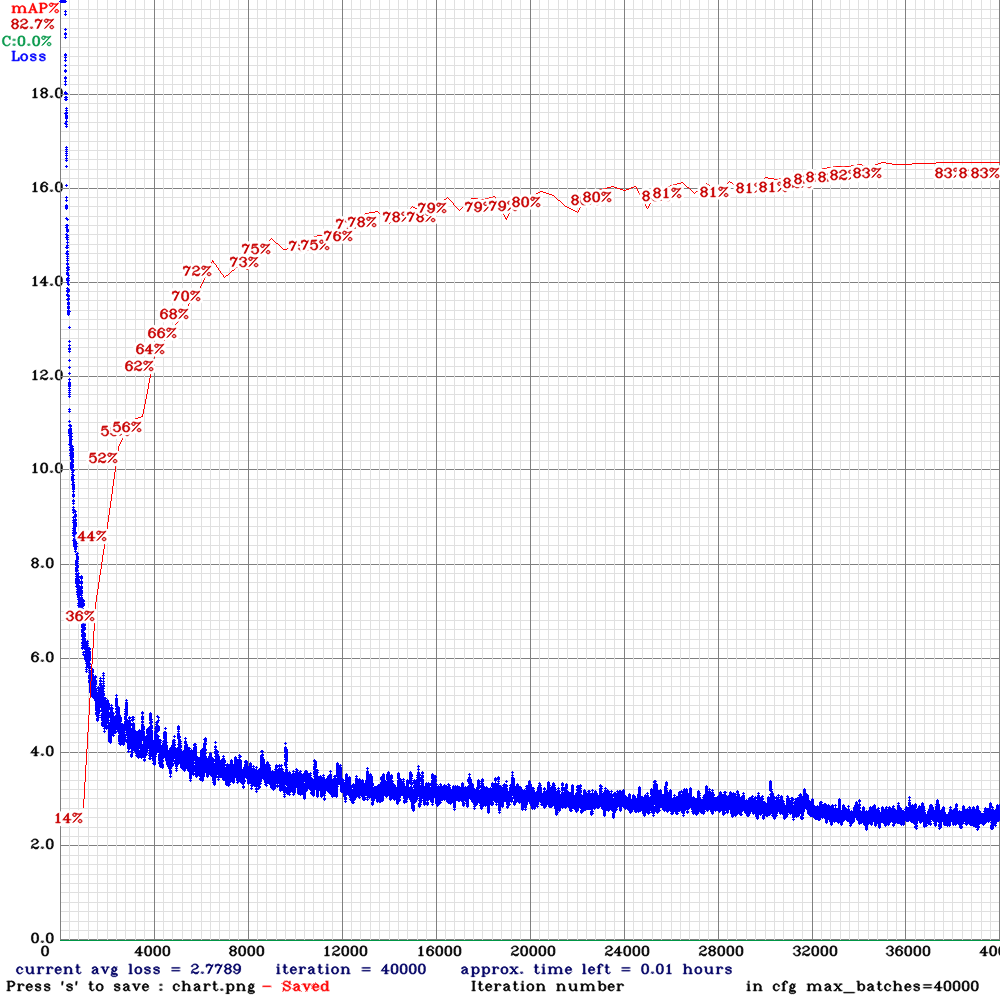

## Just set of instructions for training YOLO for counting vehicles (and similar purposes)

1. Download AIC HCMC 2020 challenge dataset. You can obtain it here: https://www.kaggle.com/datasets/hungkhoi/vehicle-counting-aic-hcmc-2020 .

    There should be YOLO-based annotations and images in downloaded archive.

2. Unzip downloaded archive. 
    ```bash
    ## If you are Linux user
    unzip archive.zip
    ```
    
3. Classes of vehicles are:
    * **motorbike** - corresponds to 0-th YOLO class;
    * **car** - 1-st
    * **bus** - 2-d
    * **truck** - 3-d

4. Use [python script](main.py) to modify classes and to prepare train and test files with absolute pathes

    ```shell
    python3 main.py
    ```

    Notice that script contains class ID modification:
    ```python
    def replace_class_with_custom_id(class_id):
        if class_id == 0:
            return 1
        if class_id == 1:
            return 0
        if class_id == 2:
            return 2
        if class_id == 3:
            return 3
    ```
    It is done for my personal case. Your mileage may vary

5. Time to train YOLO. I've picked up next setup:
    * YOLOv3-tiny as neural network architecture. (it is just my case, you can use v4 if you want to)
    * CUDA/cuDNN - turned on
    * OpenCV - enabled (for displaying loss/mAP charts)

    
    5.1. Follow [AlexeyAB's fork of Darknet](https://github.com/AlexeyAB/darknet) to setup Darknet installation. In my case Makefile has next options turned on:
        ```Makefile
        GPU=1
        CUDNN=1
        OPENCV=1
        LIBSO=1
        ```

    5.2. Prepare [class names file](vehicles.names). Change its content if you need.

    5.3. Prepare [data file](vehicles.data). You must change its content to adjust your absolute pathes:

    ```bash
    # Replace '/home/dimitrii/python_work/vehicles_yolo/' with path you need
    train  = /home/dimitrii/python_work/vehicles_yolo/train_aic_hcmc.txt
    valid  = /home/dimitrii/python_work/vehicles_yolo/val_aic_hcmc.txt
    names = /home/dimitrii/python_work/vehicles_yolo/vehicles.names
    # Don't forget to create folder for storing *.weights files while training process
    backup = /home/dimitrii/python_work/vehicles_yolo/trained_weights
    ```

    
    5.4. Download [yolov3-tiny](https://github.com/AlexeyAB/darknet/blob/master/cfg/yolov3-tiny.cfg) configuration file
    ```shell
    wget 'https://github.com/AlexeyAB/darknet/blob/master/cfg/yolov3-tiny.cfg?raw=true' -O yolov3-tiny.cfg
    ```
    
    **You can go to paragraph 5.11 and use prepared [vehicles.cfg](vehicles.cfg) if you want skip manual process.**


    5.5. Modify batch and subdivisions to match your GPU capabilities (training in CPU mode is not a good idea). In my case those parameters are:
    
    ```
    batch=64
    subdivisions=2
    ```

    5.6. Change classes size.

    Change following lines to be `classes=4`:
    
    - https://github.com/AlexeyAB/darknet/blob/master/cfg/yolov3-tiny.cfg#L135
    - https://github.com/AlexeyAB/darknet/blob/master/cfg/yolov3-tiny.cfg#L177
        
    5.7. Change filters (for every `[convolutional]` layer before each `[yolo]` layer)

    Change following lines to be `filters=27`. Since we have classes number = 4  therefore `filters = (classes + 5) * 3 = (4 + 5) * 3 = 9 * 3 = 27`):
    - https://github.com/AlexeyAB/darknet/blob/master/cfg/yolov3-tiny.cfg#L127
    - https://github.com/AlexeyAB/darknet/blob/master/cfg/yolov3-tiny.cfg#L171

    5.9. Adjust `max_batches` and `steps`

    `max_batches=40000`
    - https://github.com/AlexeyAB/darknet/blob/master/cfg/yolov3-tiny.cfg#L20

    `steps=max_batches*0.8,max_batches*0.9` => `steps=32000,36000`
    - https://github.com/AlexeyAB/darknet/blob/master/cfg/yolov3-tiny.cfg#L22

    5.10. Since I do not want to use fine tuned weights I'll use random one (just don't provide *.weights to `darknet` CLI).

    5.11. Start training. In my case CLI call looks like:

    ```shell
    darknet detector train /home/dimitrii/python_work/vehicles_yolo/vehicles.data /home/dimitrii/python_work/vehicles_yolo/vehicles.cfg -map
    ```

    After training is done you can see similar chart

    

6. In case you want "ready to go" weights here they are: [vehicles_best.weights](vehicles_best.weights). mAP is about 82%
7. Test detector

```shell
darknet detector test vehicles.data vehicles.cfg vehicles_best.weights images_samples/1.jpg
darknet detector test vehicles.data vehicles.cfg vehicles_best.weights images_samples/2.jpg
darknet detector test vehicles.data vehicles.cfg vehicles_best.weights images_samples/3.jpg
darknet detector test vehicles.data vehicles.cfg vehicles_best.weights images_samples/4.jpg
darknet detector test vehicles.data vehicles.cfg vehicles_best.weights images_samples/5.jpg
darknet detector test vehicles.data vehicles.cfg vehicles_best.weights images_samples/1.png
darknet detector test vehicles.data vehicles.cfg vehicles_best.weights images_samples/2.png
darknet detector test vehicles.data vehicles.cfg vehicles_best.weights images_samples/3.png
```